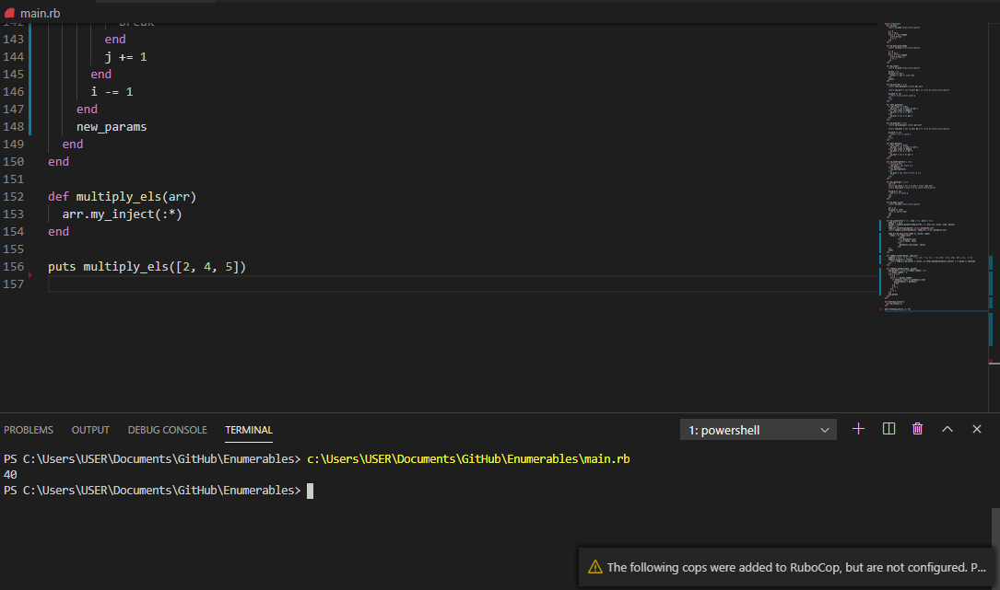

# enumerable methods

Second Ruby Microverse Project By Ángel Cussi 

# enumerable methods

Second Microverse project for Ruby Curriculum

# What it does

try to simulate all of the ennumerable methods in ruby.

## Built 

- Ruby

#### and deployed to GitHub

## Live Demo

[Live Demo](https://repl.it/github/abcussi/Enumerables)

## Authors

**Ángel Cussi**
- Github: [@profile](https://github.com/abcussi)
- Twitter: [@profile](https://twitter.com/thecussi)
- Linkedin: [profile](https://www.linkedin.com/in/angel-cussi-1b2310174/)

## 🤝 Contributing

This is a project for educational purposes only. We are not accepting contributions.

## Attributions and Credit

Special thanks to Microverse, for this learning opportunity. 

## Show your support

Give a ⭐️ if you like this project!

## Enjoy!
